## Сетевая модель не выходя ~~из дома~~ из корпуса ПК

TINYNET – модель компьютерной сети, где каждый узел представляет собой отдельный процесс в операционной системе, межпроцессное взаимодействие осуществляется через сокеты домена UNIX. В модели реализована статическая маршрутизация на основе алгоритма Флойда — Уоршелла по поиску кратчайших путей в графе.


## Что, почему  и как?

### Конфигурационный файл

Топология(*образ*) сети задаётся в конфигурационном файле формата yaml. В рамках роутеров можно задавать разные виды топологии: mesh(*полносвязная сеть*), bus(*шина*) и ring(*кольцо*).
Картинки под каждый из видов топологии сети будут показаны в разделе “Визулизация сети”. Вот пример конфигурационного файла, с которым будем работать дальше:

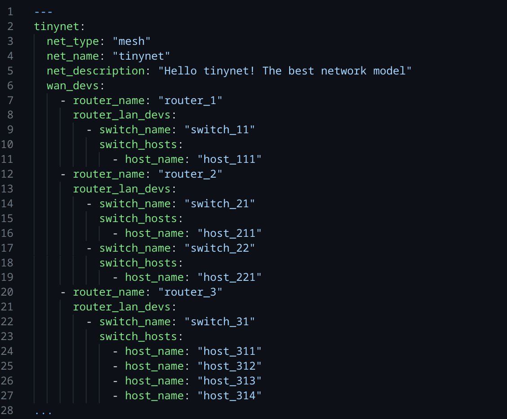

### Ответ на вопрос “как?” 

Для взаимодействия с приложением модели был реализован простейший интерфейс командной строки

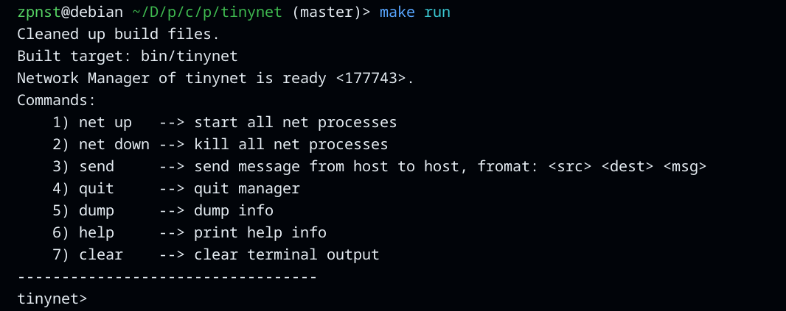

При запуске программы всё начинается c Network Manager – главного процесса модели, который порождает все остальные процессы сетевых устройств и хостов. Для того, чтобы наглядно ознакомится со всеми вышесказанным, стоит обратить внимание на PID(*Process ID*) в командной строке, которым Network Manager любезно делится.


Вот он. Это число – уникальный идентификатор процесса. С помощью стандартной утилиты pstree можно посмотреть дерево запущенных на данный момент процессов, начиная с желаемого.

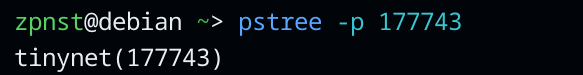

Как мы видим, при запуске программы создается процесс только для Network Manager

Инициализировать сеть можно с помощью команды net up

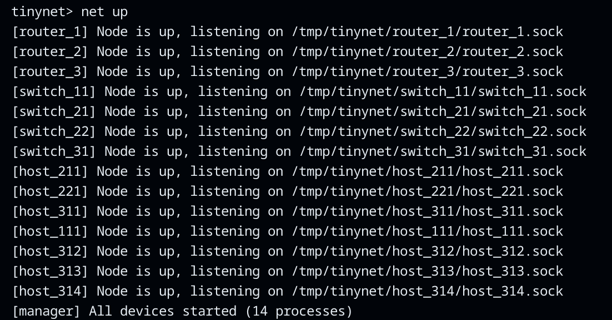

Network manager логгирует информацию о запущенных процессах устройств и  о путях к их сокетам в файловой системе(*об этом чуть позже*).

Давайте  инициализируем сеть с помощью команды net up и посмотрим как изменится вывод команды pstree

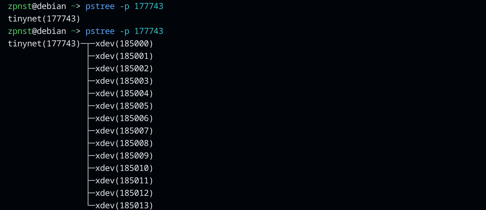

Network Manager запустил 14 процессов устройств, для которых он стал родителем

После запуска всех процессов в файловой системе по пути /tmp/tinynet создаются директории под каждое из устройств. В каждой из директорий хранится сокет и файл message.log(*у хостов*), который появляется после получения хостом первого входящего сообщения и хранит само сообщение и путь, который это сообщение прошло(*посмотрим на это чуть позже*). 

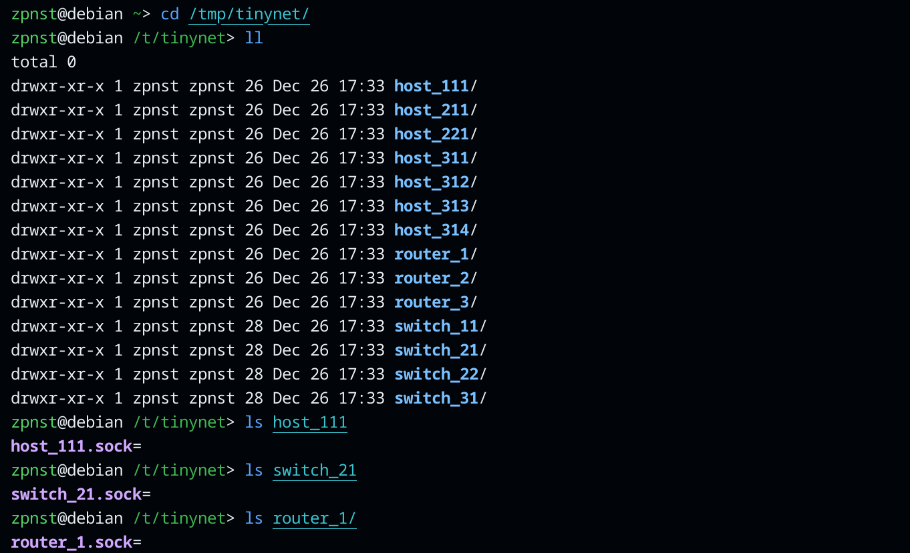

### Сокеты домена UNIX

Сокет домена UNIX - это, говоря простым языком, точка связи с конкретным процессом. Каждый процесс выступает как в роли “клиента”, так и в роли “сервера”. Сокет - это просто некоторая структура в памяти ядра операционной системы, но для прикладного программиста(*пользователя системы*), данная сущность представляется в виде файла, что является фундаментальной абстракцией всех UNIX-подобных систем. Создавая программу, мы абстрагируемся от структуры самого сокета и его внутреннего устройства(*структуры в прямом смысле, в коде ядра – это просто структуры на языке С, пусть даже запутанная и громоздкая*) и работаем с ним как с обычным файлом посредством оболочек над системными вызовами read() и write() из стандартной библиотеки языка C, что нереально удобно!


Все устройства слушают ассоциированный с ними конкретный сокет, каждый из которых имеет уникальный путь в файловой системе. То есть устройство(*процесс*), грубо говоря, ждёт пока какое-либо другое устройство(*процесс*) обратится к сокету(*т.е файлу*), по которому оно, наше устройство, ждёт соединений(*или же говорят, что оно слушает этот сокет*). Получив какие-либо данные(*массив байт*) по этому сокету – устройство преобразует их в понимаемый им вид и смотрит кто должен быть получателем этих данных, далее, по своей таблице маршрутизации определяет на какое устройство(*т.е на сокет какого из устройств*) переслать эти данные дальше, чтобы они достигли получателя. Данные таблицы формируются процессом Network Manager с помощью алгоритма Флойда — Уоршелла, чтобы сделать путь наименьшим из возможных, исходя из весов, которые формируются случайным образом(*нагляднее будет дальше*) и передаются каждому из устройств при их запуске.

### Отправка сообщений

Давайте же отправим сообщения с помощью CLI сетевого менеджера, посмотрим на вывод и на файл логов хоста-получателя, о котором было сказано выше.

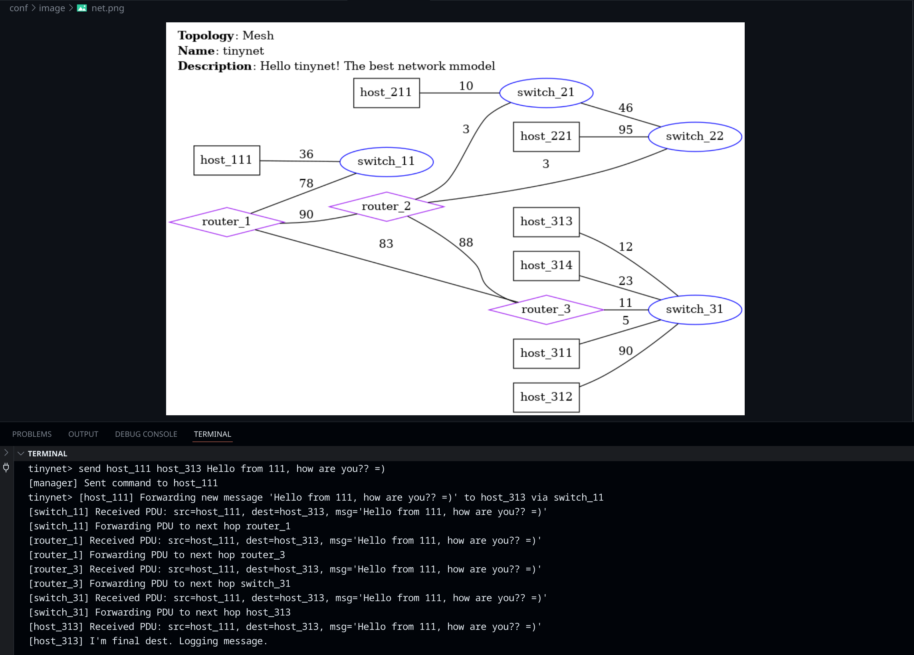

Тут Network Manager приказал хосту host_111 переслать сообщение ‘Hello from 111, how are you?? =)’ хосту host_313. Каждый из процессов(*устройств*) по пути следования пакета десериализовывает его, выводит информацию о полученном сообщении и о том, куда он собирается переслать его дальше. Да, все процессы пишут в один терминал, так как процессы устройств наследуют контекст(*какую-то системную информацию*) от процесса Network Manager, который был запущен через терминал, а у запущенных через терминал процессов STDOUT(*стандартный поток вывода*) по умолчанию идёт в этот же терминал(*это если вкратце*).

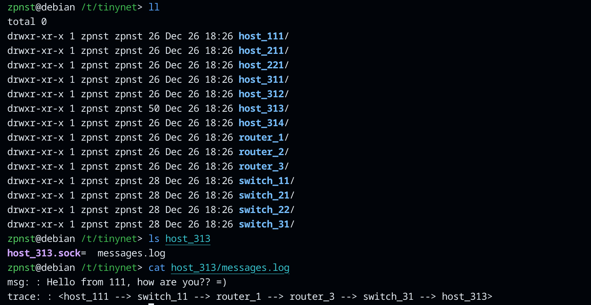

Как мы видим, в файле логов у хоста host_313 появилось это сообщение и путь, которое оно прошло, прежде чем добраться до процесса host_313

Отправим ещё несколько сообщений на этот хост:

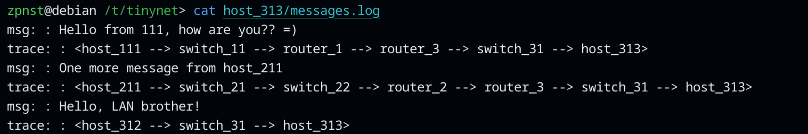

### Завершение работы программы

Команда net down завершает все процессы устройств, отправляя им сигнал SIGTERM.

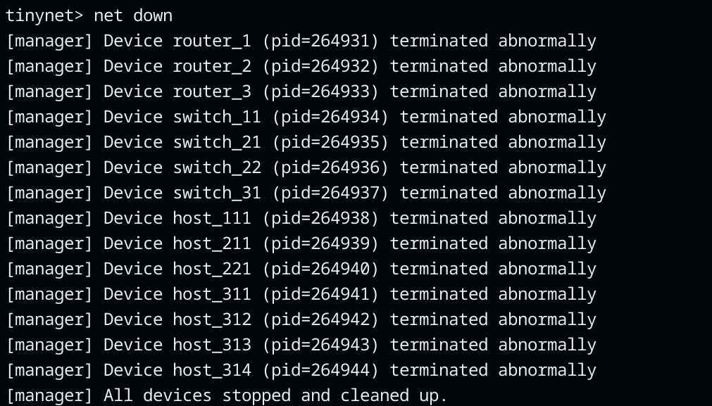

Командой quit завершается сам процесс Network Managera’a.

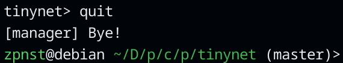

## Визулизация сети

С помощью команды dump можно визуализировать сеть всеми возможными способами, а именно: картинкой, списком всех возможных путей,  разноцвтным списком связей и таблицами коммутации и маршрутизации.
### Список связей

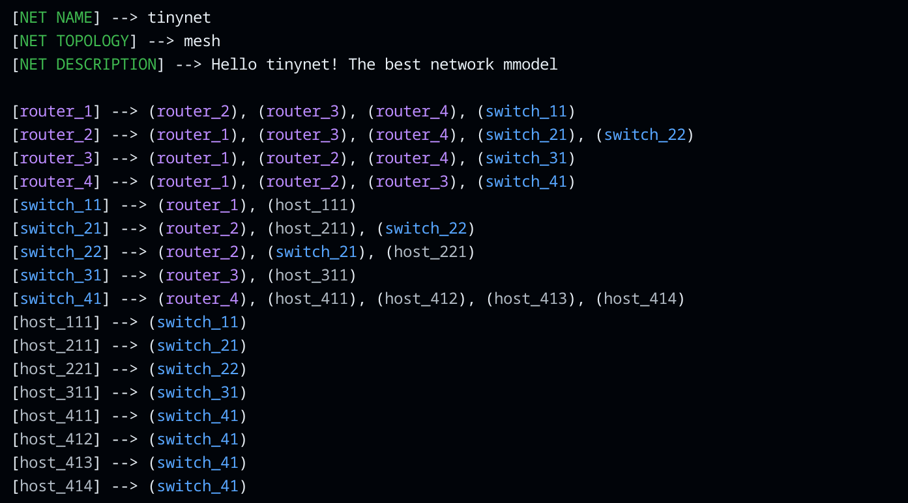

### Картинка топологии

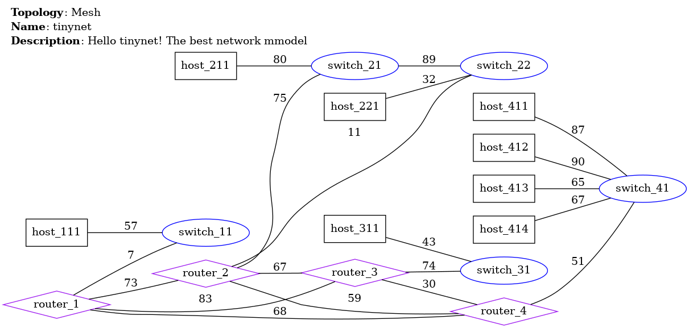

### Пути и таблицы

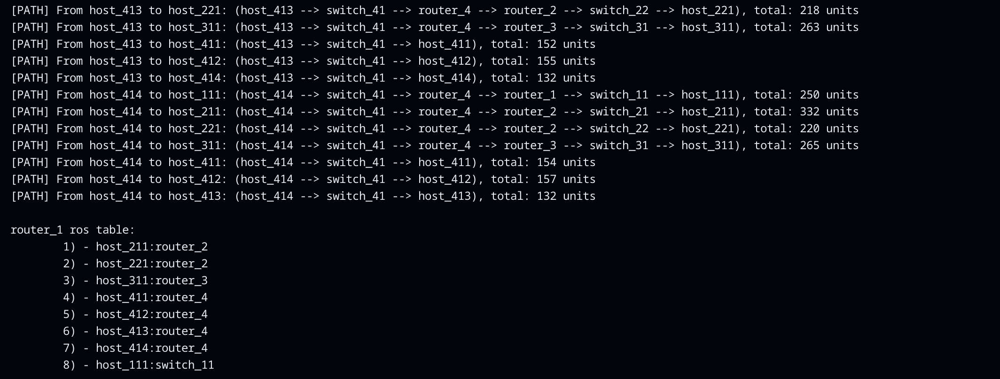

Рассмотрим картинки под каждый из видов топологии, для простоты возьмём конфигурацию с четырьмя роутерами, так как топологию мы формируем только на уровне роутеров и чтобы не захламлять картинку другими устройствами.

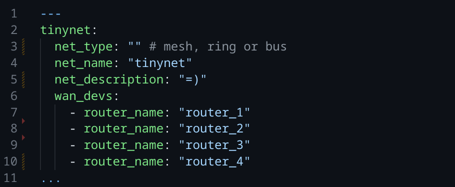

Напомню, что веса в графе формируются случайным образом как число от 1 до 100
### Mesh
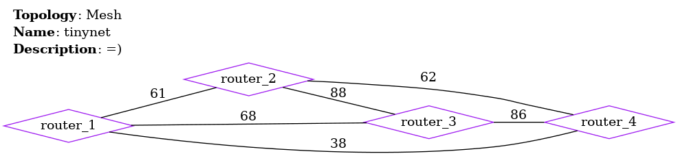

### Ring
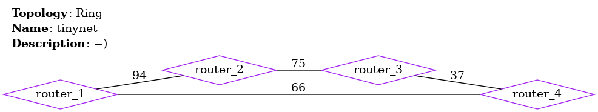

### Bus


## Из интересного
### Парсинг конфигурационного yaml файла

Файл парсился с помощью библиотеки libyaml. Вот ссылка на репозиторий – [клик!](https://github.com/yaml/libyaml/tree/master). Для того, чтобы корректно распарсить файл и обработать ошибки, которые пользователь может допустить при его формировании, пришлось написать машину состояний, так как библиотека, грубо говоря, просто идёт по файлу сверху-вниз, попутно формируя события(*например “начало документа”, “начало списка” “конец списка” “конец документа” и т.д*). Следовательно, чтобы корректно обрабатывать всё новые и новые события, формируемые библиотечным функциями по мере прохода ими по файлу, нужно иметь некую сущность, которая обладает такой характеристикой, как состояния. Состояния эти будут изменяться в зависимости от событий. В соответствии с состояниями, сущность будет выполнять определённые действия. Эта сущность и есть простейшая машина с конечным числом состояний. Конструкция switch-case языка C прекрасно подходит для таких целей.

Так, например, будет выглядеть ошибка, если пользователь введёт неверную топологию. Показывается и минимальный “трейс” ошибок.

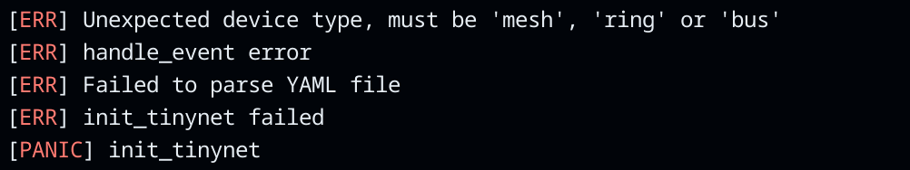

### Сериализация и десериализация данных

Данные, которые передаются по сети представляют собой некую структуру
  
```C
typedef struct tinynet_pdu_s {
   char src[BUFFERFI_S];
   char dest[BUFFERFI_S];
   char next_hop[BUFFERFI_S];
   char compr_msg[MSG_BUFFER_S];
   char trace_buf[TRACE_BUFFER_S];
} tinynet_pdu_t;
```

Так как язык C позволяет приводить какие угодно типы к каким угодно другим типам, мы можем легко привести тип указателя на структуру к типу указателя на char(*на массив байт*) и тем самым отправить эти данные просто как строку. 

Да, структура в памяти и есть просто массив байт, но если мы приведём указатель на структуру к типу указателя на массив байт, то компилятор по настоящему начнёт интерпретировать это как обычный массив байт, а не как структуру(*некую сущность, к полям которой можно обращаться по отдельности*). На принимающем устройстве можно сделать обратное. Для этих целей была создана универсальная функция, которая в зависимости от типа операции или сериализует, или десериализует данные. Процесс по сути одинаковый. Приведение типов и адресная арифметика дала нам возможность создать единую компактную функцию как для сериализации, так и для десериализации данных, передаваемых по сети.

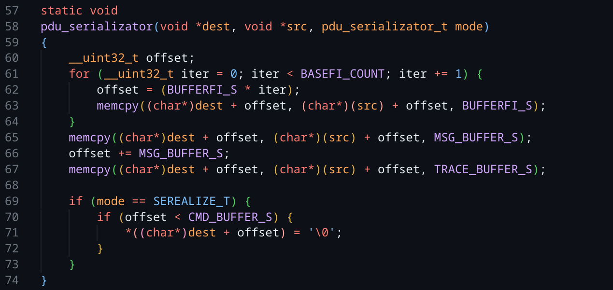

### Визуализация

Визуализация работает с помощью программы graphviz. Исходя из полученной из файла конфигурации топологии сети, формируется .dot файл с данными, понятными программе graphviz, которая любезно скрывает от нас все тонкости формирования .png картинки, позволяя сделать это одной лаконичной командой.

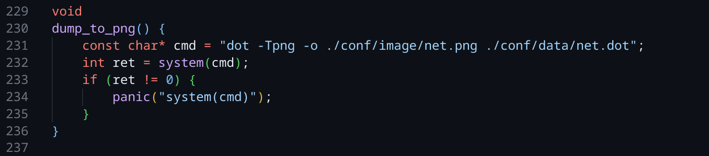

Вот так выглядит .dot файл, создаваемый моей программой при вводе команды dump, которая рассматривалась выше на примере топологий из раздела “Визуализация сети”

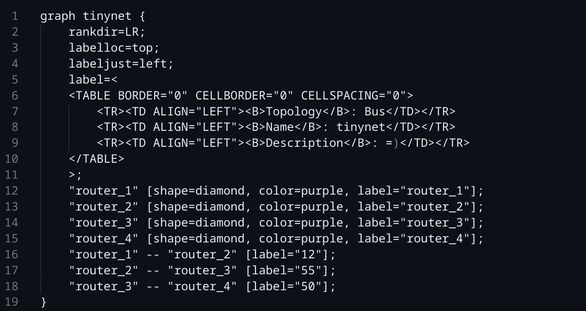

Да, тут всё просто =)

## Заключительные слова
Данная сетевая модель будет полезна для изучения людям, которые хотят посмотреть “какое никакое” применения популярных системных вызовов Linux на практике.

PS: Структура проекта оставляет желать лучшего, как по мне. Лучше было бы оставить исчерпывающие комментарии ко всем функциям и лучше распределить директории и заголовочные файлы, но написать библиотеку задача не стояла. Самая главная задача заключалась в том, чтобы автор узнал некоторые новые для себя вещи и “пощупал их на практике” =)

Всем спасибо за внимание!
